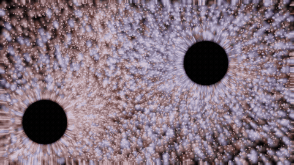

# cosmosim

Real-time 3D N-body gravity simulator with quasar physics, relativistic jets, and black hole rendering. Simulates galaxy mergers with event horizons, photon rings, gravitational lensing, and Doppler-shifted particle dynamics using the Barnes-Hut algorithm.

 

## Galaxy Merger Simulation

Milky Way - Andromeda collision with 100,000 gravitationally interacting particles, two supermassive black holes, relativistic jets, and physically-based gravitational lensing.

<p align="center">

</p>

### Multiple viewing angles

| Top-down | Edge-on | Side view |
|:--------:|:-------:|:---------:|
|  |  |  |

## Features

### Gravity
- **Barnes-Hut octree** for O(N log N) force computation
- **Symplectic leapfrog integrator** (kick-drift-kick) for energy conservation
- **OpenMP parallelization** of force calculations
- Plummer softening to prevent close-encounter ejection

### Quasar Physics
- **SMBH accretion** with Eddington-limited luminosity
- **Relativistic jets** with D^3 Doppler beaming, limb brightening, knot structure, and helical morphology
- **Jet lobes** — hotspot/cocoon structures at jet termination points
- **AGN feedback** — radiation pressure drives gas outward
- **Particle recycling** — distant jet particles recycle as infalling gas

### Rendering
- **Event horizon shadow** with soft edge at Schwarzschild radius
- **Photon ring** (primary + secondary) with frame-dragging Doppler asymmetry
- **Schwarzschild gravitational lensing** — proper 1/b deflection with Einstein ring
- **Procedural background starfield** sampled at lensed UV for visible star arcs
- **Adaptive HDR exposure** with Reinhard tonemapping
- **Bloom** with multi-pass Gaussian blur
- **Relativistic Doppler color shifts** — blue-shift approaching, red-shift receding

### Merger Physics
- Milky Way / Andromeda mass ratio (1:1.2)
- Tilted disk geometry (50 deg relative inclination)
- Nearly radial approach with dynamical friction merger
- Dual SMBH tracking with independent event horizons and jets

## Building

Requires CMake 3.16+ and a C11 compiler. GLFW is fetched automatically.

```bash
cmake -B build -DCMAKE_BUILD_TYPE=Release
cmake --build build
```

## Usage

```bash
# Single spiral galaxy (20k bodies)
./build/cosmosim

# Quasar merger — Milky Way vs Andromeda (100k bodies)
./build/cosmosim -q -m -n 100000

# Offline render to video frames
./build/cosmosim -q -m --render frames --frames 600 --render-substeps 32 -n 100000

# Render from different camera angle
./build/cosmosim -q -m --render frames --frames 600 -n 50000 \
    --cam-azimuth 0.0 --cam-elevation 1.5

# Encode frames to video
ffmpeg -framerate 60 -i frames/frame_%06d.ppm -c:v libx264 -pix_fmt yuv420p output.mp4
```

### Controls (Interactive Mode)

| Input | Action |
|-------|--------|
| Left-click drag | Orbit camera |
| Right/middle-click drag | Pan |
| Scroll wheel | Zoom in/out |
| Space | Pause/resume |
| R | Reset camera |
| Q / Esc | Quit |

## Testing

```bash
cmake -B build -DCMAKE_BUILD_TYPE=Release && cmake --build build && ./build/test_physics
```

26 tests covering octree construction, force computation (Newton's 3rd law, inverse-square, octree-vs-direct), integrator conservation laws, initial conditions, quasar accretion/feedback, jet spawning/recycling, camera smoothing, and lobe creation. No GPU required.

## Architecture

| Module | Purpose |
|--------|---------|
| `body.h` | Body struct with position, velocity, mass, type (STAR/GAS/SMBH/JET/DUST/LOBE), spin axis, luminosity |
| `octree.c/h` | Barnes-Hut octree with flat pool allocator, rebuilt each substep |
| `integrator.c/h` | Kick-drift-kick leapfrog, configurable substeps per frame |
| `renderer.c/h` | OpenGL HDR pipeline: particle rendering, bloom extraction/blur, composite with lensing + event horizon |
| `quasar.c/h` | SMBH accretion, AGN feedback, jet spawning (ring cross-section + burst knots), lobe creation, particle recycling |
| `initial_conditions.c/h` | Exponential-disk galaxies, quasar merger with tilted disks and orbital velocities |
| `src/shaders/` | GLSL 330: Schwarzschild lensing, photon rings, Doppler beaming, temperature-based particle coloring |

## How It Works

Each frame:

1. **Build octree** over all body positions, computing center-of-mass at each node
2. **Compute forces** via Barnes-Hut tree walk (distant clusters = point masses)
3. **Quasar step** — accretion, luminosity update, AGN feedback, jet decay/spawning, lobe creation
4. **Integrate** — symplectic leapfrog (configurable substeps for accuracy)
5. **Render** — upload to GPU, draw point sprites, HDR bloom, composite pass with gravitational lensing, event horizons, photon rings, tonemapping

Physics at `double` precision; renderer converts to `float` for GPU. Camera tracks SMBH midpoint with exponential smoothing. Shaders loaded from disk at runtime.
